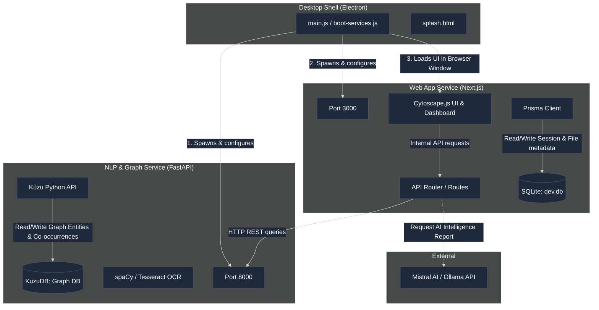
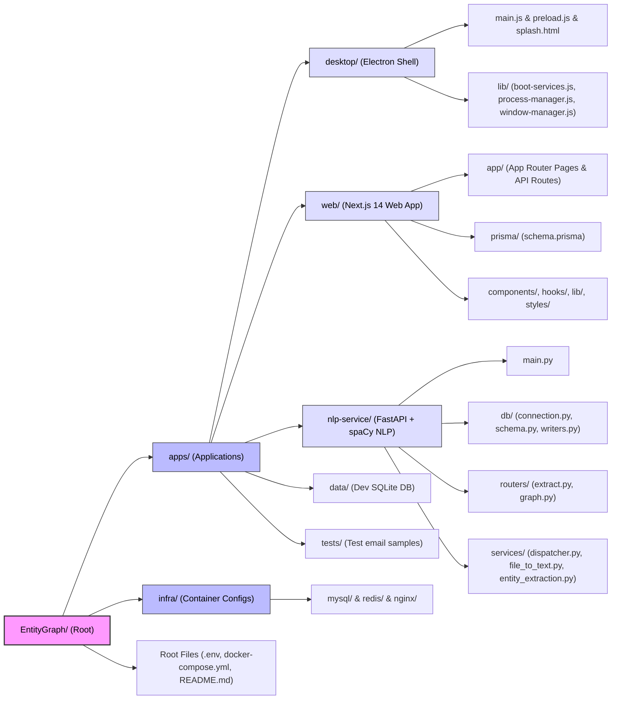
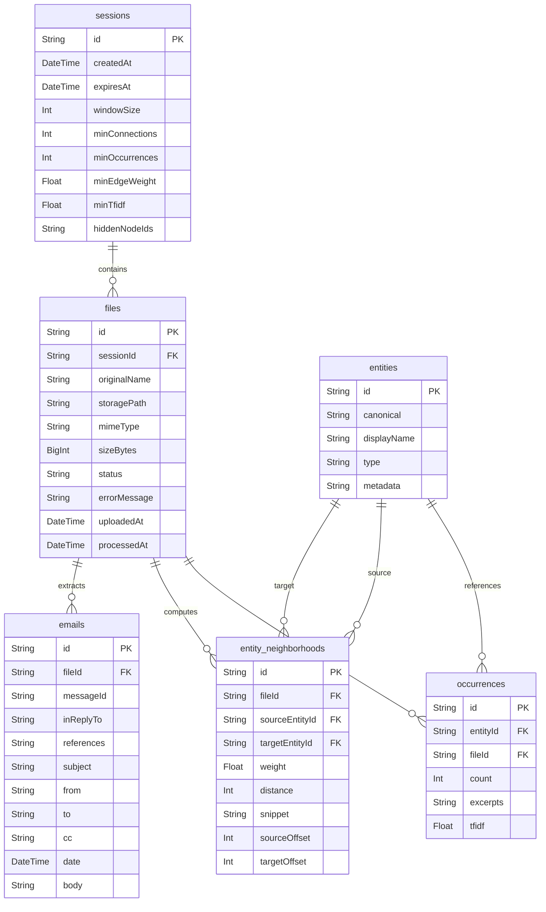
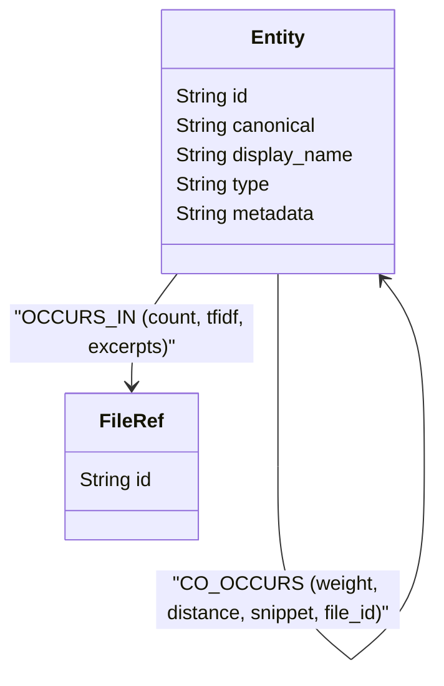
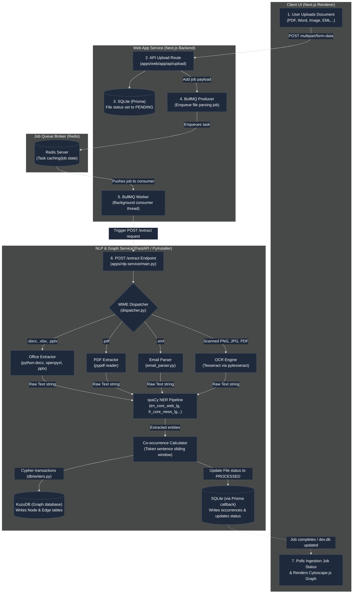

# Project Architecture & General Structure Schema

This document provides a detailed overview of the system architecture, directory structure, data schemas, and information flow of **Hackmanite (EntityGraph Explorer)**. It is structured for direct inclusion or adaptation in written technical reports.

---

## 1. High-Level System Architecture

Hackmanite implements a **decoupled, multi-service standalone desktop architecture**. Instead of hosting services on a remote server, it compiles and runs a frontend UI web server, a relational metadata database, an embedded graph database, and a machine learning (NLP) pipeline locally inside an Electron shell wrapper.

### 1.1 Architectural Details
* **Process Lifecycle & Bootstrapping**: The Electron main process ([main.js](file:///c:/Users/maxen/Documents/POLYTECH/Stage_FI4/EntityGraph/EntityGraph/apps/desktop/main.js)) acts as the master controller. At boot, [boot-services.js](file:///c:/Users/maxen/Documents/POLYTECH/Stage_FI4/EntityGraph/EntityGraph/apps/desktop/lib/boot-services.js) performs pre-flight checks: it clears TCP port conflicts (killing processes on ports `3000` and `8000`), configures path variables, and spawns the Next.js and FastAPI services as background subprocesses using Node's `child_process.spawn`.
* **Subprocess Management**: Electron tracks child process PIDs and registers shutdown hooks (`app.on('will-quit')`) to ensure all subprocesses (Python NLP engine and Next.js server) are cleanly terminated, preventing orphaned background processes.
* **Database Relational Layer**: Relational structures (sessions, user files, extraction logs, and email objects) are stored in an SQLite database file (`dev.db`). During boot, Electron programmatically runs Prisma migrations (`npx prisma db push`) to synchronize the database schema without requiring external CLI tools.
* **Graph Database Layer**: Entity nodes and co-occurrence edges are stored in an embedded **KuzuDB** database instance. The database is accessed via Kùzu's Python API in the FastAPI process, operating directly on the file system at `kuzu_data/kuzu.db` under the user's OS-specific app data folder.
* **Communication Protocols**:
  * **Frontend-to-Backend**: The Electron BrowserWindow displays the Next.js client (`http://localhost:3000`).
  * **Inter-Service REST API**: Next.js server-side API routes proxy computationally intensive parsing and graph traversal operations to the FastAPI NLP engine (`http://127.0.0.1:8000`) using standard HTTP/REST requests.

---

## 2. Directory Structure Schema

The repository is organized as a monorepo containing self-contained applications under `apps/` and infrastructure assets under `infra/`.

---

## 3. Database & Graph Schemas

Hackmanite adopts a **dual-database design** to maximize performance. **SQLite** manages tabular, transactional relational metadata, while **KuzuDB** handles highly complex graph traversals and co-occurrences.

### 3.1 SQLite Relational Schema (via Prisma)
Defined in [schema.prisma](file:///c:/Users/maxen/Documents/POLYTECH/Stage_FI4/EntityGraph/EntityGraph/apps/web/prisma/schema.prisma):

### 3.2 KuzuDB Graph Database Schema
Defined in [schema.py](file:///c:/Users/maxen/Documents/POLYTECH/Stage_FI4/EntityGraph/EntityGraph/apps/nlp-service/db/schema.py):

#### Node Tables
* **`Entity`**:
  * `id` (STRING, Primary Key): Unique identifier of the entity.
  * `canonical` (STRING): Case-insensitive standard representation of the name.
  * `display_name` (STRING): Formatted name for UI rendering.
  * `type` (STRING): Entity classification (e.g. `PERSON`, `ORG`, `LOC`, `EMAIL`, `PHONE`).
  * `metadata` (STRING): Structured JSON storing entity context.
* **`FileRef`**:
  * `id` (STRING, Primary Key): ID referencing the corresponding `File` record in SQLite.

#### Relationship Tables
* **`OCCURS_IN`** (From `Entity` to `FileRef`):
  * `count` (INT64): Frequency of the entity within the document.
  * `tfidf` (DOUBLE): Relative statistical salience of the entity in the file.
  * `excerpts` (STRING): Text fragments containing occurrences.
* **`CO_OCCURS`** (From `Entity` to `Entity`):
  * `weight` (DOUBLE): Co-occurrence weight (decayed by token distance).
  * `distance` (INT64): Average token distance between the two entities.
  * `snippet` (STRING): Text snippet enclosing the co-occurrence window.
  * `source_offset` (INT64): Character offset of source entity.
  * `target_offset` (INT64): Character offset of target entity.
  * `file_id` (STRING): ID of the file where the co-occurrence was recorded.

---

## 4. Data Ingestion Pipeline Schema

The diagram below details the asynchronous ingestion lifecycle of a document, tracking its path from the user interface through the scheduling queue, the text extraction/OCR parsing engines, the NLP named entity recognition parser, and finally into the persistent storage engines.

### 4.1 Ingestion Phase Details
1. **File Upload & Relational Logging**: Next.js receives files at the upload route, writes them locally to `/uploads`, and saves a file catalog entry inside SQLite with the status `PENDING`.
2. **Queueing (BullMQ & Redis)**: Next.js enqueues a job payload containing the file UUID using **BullMQ**. The job is pushed to the local **Redis** instance acting as a robust queue broker.
3. **Job Worker Processing**: The BullMQ worker thread fetches the job and issues an HTTP POST request invoking the FastAPI `/extract` endpoint.

### 4.2 Extraction & Analysis Phase Details
1. **MIME Dispatching**: The FastAPI routing layer intercepts the file path and calls the `dispatcher.py` service. Based on the MIME type, the file is routed to:
   * **Office Extractor**: uses standard python libraries to read `.docx`, `.xlsx`, and `.pptx` files.
   * **PDF Extractor**: parses standard text-based PDF documents.
   * **Email Parser**: processes `.eml` files, extracting headers, body content, and attachments.
   * **OCR Engine**: uses **Tesseract** to parse scanned images and image-based PDFs.
2. **Named Entity Extraction**: The raw text output is run through a **spaCy** large language model pipeline tailored to the detected document language (`en_core_web_lg`, `fr_core_news_lg`, or `ru_core_news_lg`). It extracts entity classifications (persons, places, dates, etc.).
3. **Co-occurrence Analysis**: Neighboring entities are evaluated using a sentence-bounded sliding token window. Proximity weightings and snippets are calculated for graph-edge constructions.

### 4.3 Database Synchronization & Rendering
1. **Graph DB Insertion**: Nodes representing `Entity` and `FileRef` and edges representing `OCCURS_IN` and `CO_OCCURS` are added to **KuzuDB** using parameterized Cypher statements.
2. **Relational Synchronization**: In parallel, occurrence counts and text neighborhoods are saved to SQLite via a callback, and the file status is marked as `PROCESSED`.
3. **UI Update**: Next.js UI queries the updated graph and renders the interactive network using **Cytoscape.js**.
