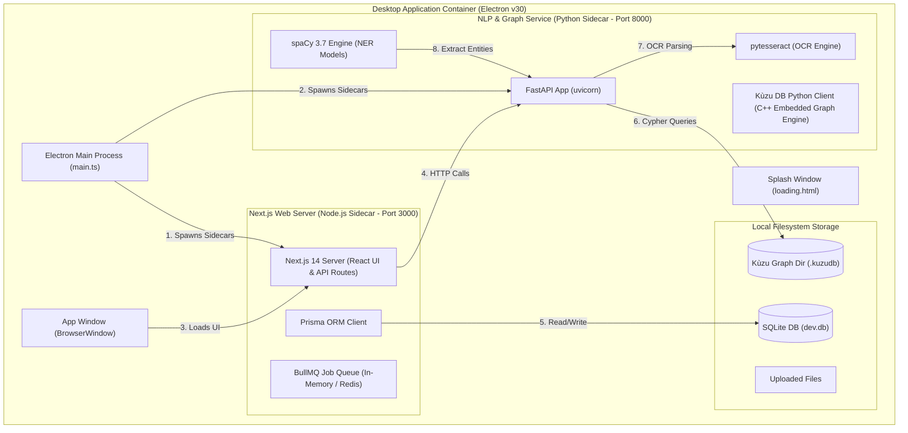
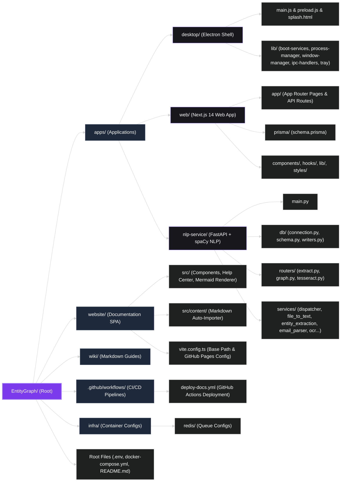
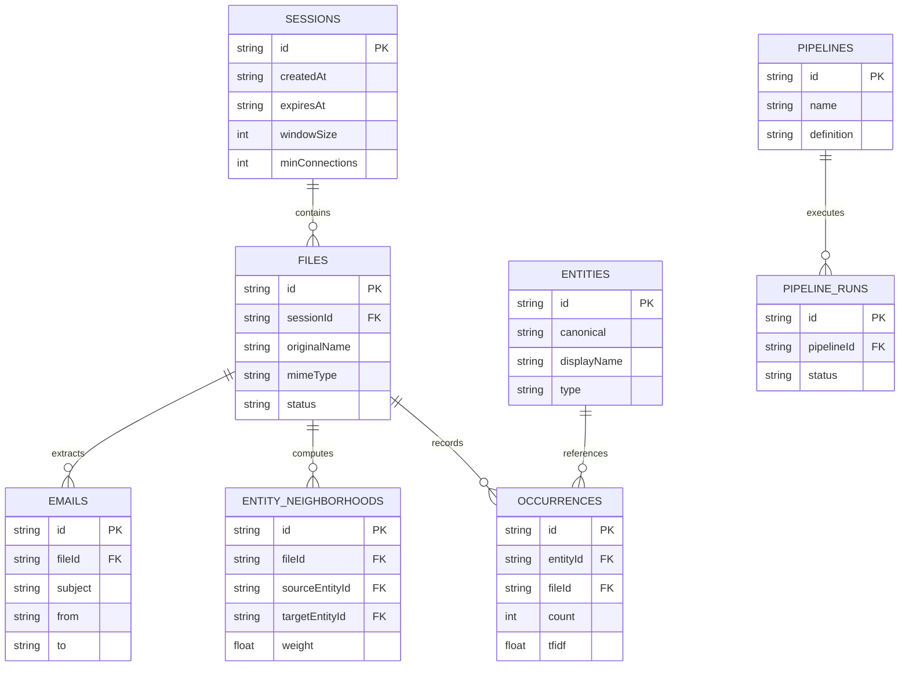
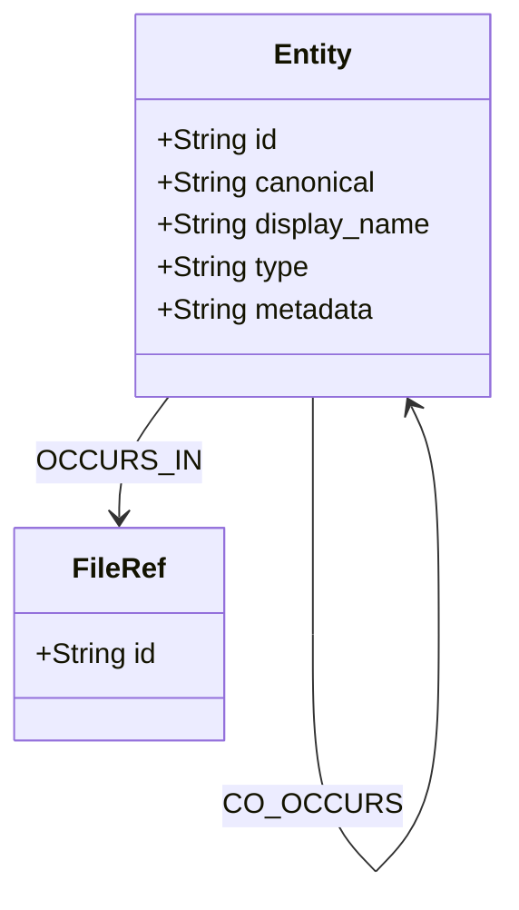
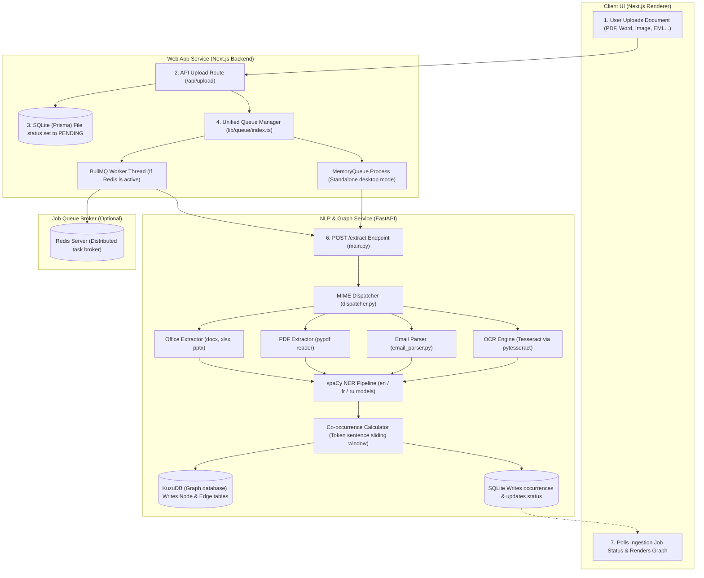

# 9. Project Architecture & System Design

Hackmanite (EntityGraph Explorer) implements a **decoupled, multi-service standalone desktop architecture** inside an Electron shell wrapper. This document details the component boundaries, IPC communications, dual database engine setup, file processing pipelines, and build targets.

---

## 1. High-Level System Topology

---

## 2. Directory Structure Schema

The repository is organized as a monorepo containing self-contained applications under `apps/` and infrastructure assets under `infra/`.

---

## 3. Database & Graph Schemas

Hackmanite adopts a **dual-database design** to maximize performance. **SQLite** manages tabular, transactional relational metadata and custom pipeline workflows, while **KuzuDB** handles highly complex graph traversals and co-occurrences.

### 3.1 SQLite Relational Schema (via Prisma)

### 3.2 KuzuDB Graph Database Schema

---

## 4. Data Ingestion Pipeline Schema

The diagram below details the asynchronous ingestion lifecycle of a document, tracking its path from the user interface through the scheduling queue, the text extraction/OCR parsing engines, the NLP named entity recognition parser, and into storage.

