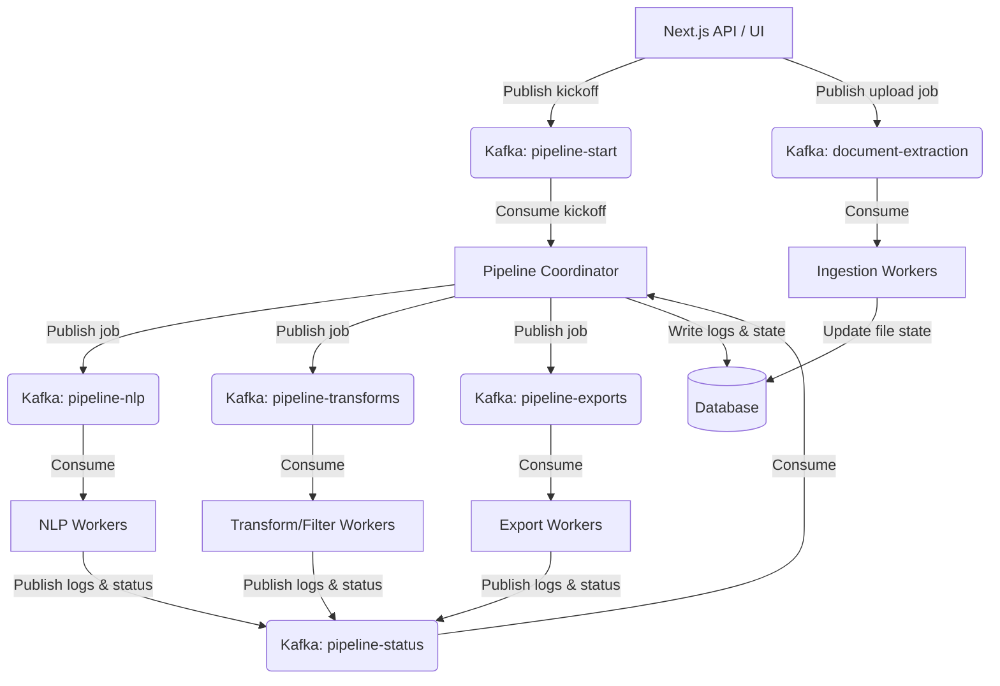

# Distributed Kafka Pipeline Architecture

This page documents the distributed execution engine for Hackmanite ETL pipelines, designed for high-scale environments using Apache Kafka, Kubernetes, and S3-compatible object storage.

---

## Architecture Overview

The distributed pipeline model decouples the Next.js web application from the execution engine, replacing the local in-memory worker queues with a centralized coordinator and a pool of horizontally scalable worker pods.



---

## Key Concepts

### 1. Centralized Orchestration
* **Pipeline Coordinator**: Runs as a lightweight service. It parses the pipeline JSON definition, performs a topological sort, and maps execution states. It publishes node jobs when parent dependencies are satisfied, and consumes execution progress events.
* **Database Updates**: The coordinator consolidates worker logs and node states (`idle`, `running`, `success`, `error`) back to the main relational database, ensuring that Next.js UI polling routes `/api/pipelines/runs/[id]` display real-time statuses without changes.

### 2. Claim Check Pattern (Object Storage)
Because graph and tabular datasets can be very large, passing raw data over Kafka is inefficient. 
* **Mechanism**: Intermediate outputs are stored in **MinIO** or **AWS S3** (using a shared path/PVC mount in development).
* **Kafka Message**: Contains only metadata references (e.g. S3 URI, run ID, and node ID).
* **Execution**: Worker pods download inputs, execute their logic, upload results, and output a new file URI reference to Kafka.

### 3. Kafka Topics Layout
* `pipeline-start`: Kicksoff runs.
* `pipeline-status`: Workers publish log messages and state completions.
* `pipeline-nlp`: Task jobs for ingestion, doc/email parsing, and web scraping.
* `pipeline-transforms`: Task jobs for filters, entity resolution, and LLM annotations.
* `pipeline-exports`: Task jobs for GraphML, CSV, JSON, and Obsidian vault packaging.
* `document-extraction`: Task jobs for document file uploads (parsing, OCR, spaCy NLP extraction).

### 4. Kubernetes Scaling (KEDA)
Workers run in isolated consumer groups. By using **KEDA (Kubernetes Event-driven Autoscaling)**, you can scale worker deployment pods based on topic lag. For example, if there is a massive backlog in `pipeline-nlp` or `document-extraction`, KEDA automatically scales up the corresponding worker pods and drops them back to zero once finished.

### 5. Unified Ingestion Queue
Document uploads and pipeline runs are both routed to Kafka. If Kafka is not active, the system falls back to a local database-backed in-memory queue.

---

## Configuration (Environment Variables)

To activate and run the distributed Kafka pipeline, configure the following variables in your `.env` file:

```env
# Kafka Configuration (Setting this activates Kafka instead of the local queue)
KAFKA_BOOTSTRAP_SERVERS="localhost:9092"
KAFKA_CLIENT_ID="hackmanite-pipeline"

# Payload Cache (Shared directory mounted to K8s pods, or local dev cache)
SHARED_CACHE_DIR="./uploads/pipeline-cache"
```

### Launching the Full Stack

Use the `docker-compose.kafka.yml` override on top of the base `docker-compose.yml`.
The Kafka broker, Coordinator, and Worker are all started automatically — no manual daemon terminals needed.

```powershell
# From the repository root

# Production
docker compose -f docker-compose.yml -f docker-compose.kafka.yml up --build

# Development (hot-reload on web + nlp)
docker compose -f docker-compose.yml -f docker-compose.kafka.yml -f docker-compose.dev.yml up --build
```

### Launching on Kubernetes (Minikube / Local K8s)

Kubernetes manifests are located in the `k8s/` folder. They deploy the Next.js frontend, spaCy NLP backend, KRaft Kafka broker, PostgreSQL database, coordinator daemon, and worker daemon with KEDA-based autoscaling.

Deploying to local Minikube:
1. Start Minikube with Ingress and point your shell to its Docker daemon:
   ```bash
   minikube start --driver=docker
   minikube addons enable ingress
   eval $(minikube docker-env)
   ```
2. Build the images:
   ```bash
   docker build -t hackmanite-web:latest ./apps/web
   docker build -t hackmanite-daemon:latest --target daemon ./apps/web
   docker build -t hackmanite-nlp:latest ./apps/nlp-service
   ```
3. Prepare the local hostPath directories:
   ```bash
   minikube ssh "sudo mkdir -p /var/lib/hackmanite/uploads /var/lib/hackmanite/postgres && sudo chmod -R 777 /var/lib/hackmanite"
   ```
4. Deploy the manifests:
   ```bash
   kubectl apply -f k8s/
   ```
5. Configure KEDA to scale workers from `1` up to `10` instances automatically based on the `document-extraction` Kafka topic lag threshold (5 messages per pod). Pod scaling can be watched using:
   ```bash
   kubectl -n hackmanite get scaledobject
   kubectl -n hackmanite get pods -l app=worker -w
   ```

> **Running daemons manually (native dev only)**
> If you want to run the daemons outside Docker (e.g. alongside `npm run dev`):
> ```powershell
> # Coordinator
> $env:KAFKA_WORKER_ROLE="coordinator"
> cd apps/web
> npx tsx scripts/kafka-daemon.ts
>
> # Worker (separate terminal)
> $env:KAFKA_WORKER_ROLE="worker"
> $env:KAFKA_WORKER_TOPICS="pipeline-transforms,pipeline-nlp,pipeline-exports"
> cd apps/web
> npx tsx scripts/kafka-daemon.ts
> ```
